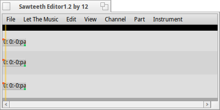

# Sawteeth

Sawteeth is a feature-rich soft synth for BeOS and Haiku, meant for creating cool synthsounds for more advanced digital audio workstations, as well as plain, cute chip-tunes.

## Features

* Retro feel, all the way 
* Low resource usage
* Fast synthesis
* Includes a tracker!
* No samples, only generated waveforms! 
* Waveform types include: Saw, Square, Triangle, Noise, Sinus
* Filter and clipping with many modes
* 'ADSR' for filter and amp
* Pattern editor, transposing included!

### Specifications

* The sound synthesis is of high quality with little aliasing noise, 44kHz and float precision, however, some of the filters and clipping add aliasing noise, so use them carefully.
* The antialiasing method is known as "infinite oversampling with boxfilter".
* Modulation rate is static for a song but can be anything between 0.673Hz and 44100Hz (lousy performance at high modrate)

## Authors & Acknowledgements

* Adrien Destugues - *Current maintainer*
* Stefan Hållén - *Provided filter code*
* Arvid Norberg - *Work on the editor, original author*
* Jonas Norberg - *Original author*

## License

This project is licensed and distributed under the MIT license.

## Documentation

If you're curious about learning how to use Sawteeth in depth, check out [Linus Åkesson's website](http://www.linusakesson.net/music/elements/index.php).
